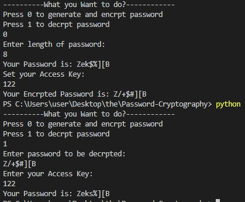
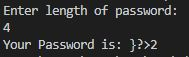
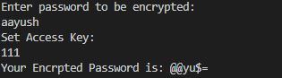
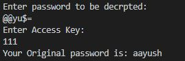

# Password-Cryptography

In today's world internet is the new fuel and most important for an individual in this world is privacy. So, to keep your data safe you require a strong password which can not be guessed. This script helps you to generate, encrypt and decrypt passwords. This script generates password from 52 alphabetic characters (uppercase and lowercase), 10 digits, and 16 special symbols and encrpyts it on the go with asking a access key from user and setting it. With the encryted password it would take 28 Billion years for anyone having no access key to crack it. But I have made it easy for user who want to distribute their data in secure way as this repo also contains decrypter, from which you can easliy decrypt your passwords after entering access key. By this way you can easily distribute data giving access key to trusted person and decrypter script. This project is in development phase and more features are to be added soon.

## Quick Start
- Clone this repository

      git clone https://github.com/Aayush-hub/Password-Cryptography.git

- Change directory

      cd Password-Cryptography

      
- Run python file

      python <file you want to run>

### Secure password full file.py 

- This profile is full workflow of generating password, encrypting and decrypting it.
- Enter 0 to generate, encrpyt password and setting access key to share or enter 1 to decrypt password.
- If you have choosen 0, then input the required length of password to be generated.
- After generating password set access key and get the encrypted password.
- If you have choosen 0, then input the required length of password to be generated.
- After generating password set access key and get the encrypted password.

### Password Generation
- This file is for generating passwords using 52 alphabetic characters (uppercase and lowercase), 10 digits, and 16 special symbols.
- Enter required length of your password.  (Pro Tip: It is suggested that password should be of 8 characters long to be strong) 

### Password Encryption
- This file is for encrypting your pre-generated password or a personal password.
- Just type your password, set access key and get encrypted one.

### Password Decryption
- This file is for decryption of your passwords.
- Just enter your encrypted password , access key and get the original one.

## Contributing to this project!! 

- Fork this repository

- Clone the Repository 

- Add upstream 

      git add upstream https://github.com/Aayush-hub/Password-Cryptography.git
      git remote -v, to check upstream successfully added

- Add your files or make changes in files

- Add Changes    ` git add .`

- Commit Changes   ` git commit -m "your message here" `

- Push changes     ` git push `

- Make Pull Request

